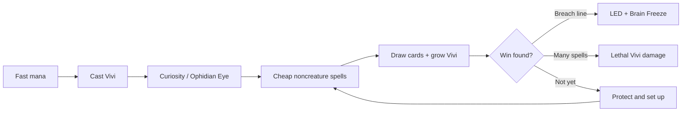
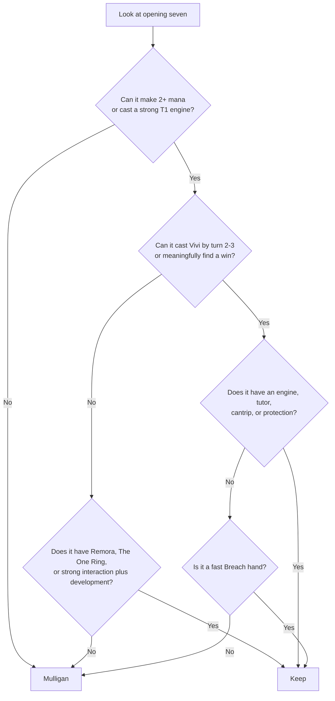
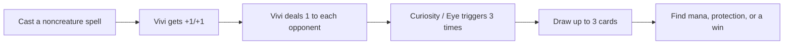
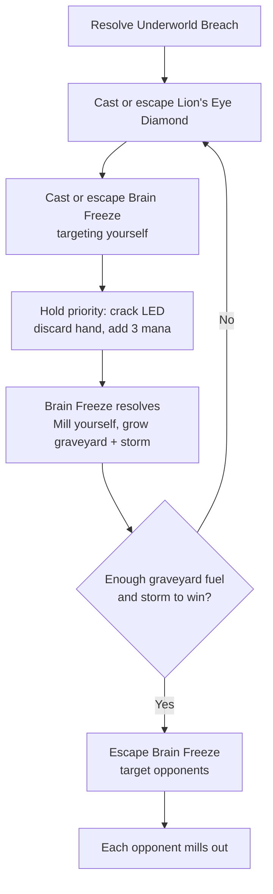
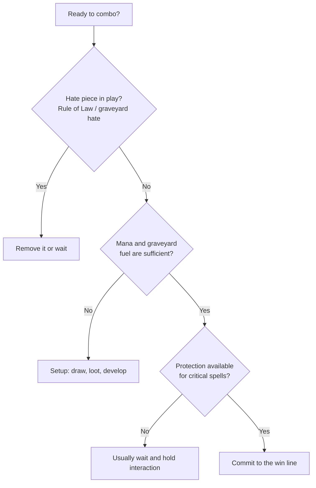

# Vivi Ornitier cEDH Primer

	

> [!IMPORTANT]
> **Your commander is an engine, not an infinite-mana outlet.** Vivi's mana ability may be activated only once on each of your turns. Grow Vivi first; use the mana burst when it meaningfully advances your turn.

This is a proactive Izzet combo deck. Your commander, **Vivi Ornitier**, turns every noncreature spell into a permanent +1/+1 counter and one damage to every opponent. That damage becomes an engine when Vivi has **Curiosity** or **Ophidian Eye** attached: each opponent damaged lets you draw a card.

## At A Glance

| Role | What you are trying to do | Key cards |
| --- | --- | --- |
| ⚡ Accelerate | Get Vivi down ahead of schedule. | Fast mana, Ragavan, Mystic Remora |
| 📚 Draw | Turn Vivi damage into a torrent of cards. | Curiosity, Ophidian Eye, Tandem Lookout |
| 🛡️ Protect | Stop a win or force through your own. | Force of Will, Fierce Guardianship, Pyroblast |
| 💥 Finish | Use graveyard recursion and storm to end the game. | Underworld Breach, Lion's Eye Diamond, Brain Freeze |

### Your Game Plan

1. Make fast mana and cast Vivi.
2. Protect Vivi long enough to resolve Curiosity or Ophidian Eye.
3. Cast cheap noncreature spells, draw through the deck, and grow Vivi.
4. Convert the cards and mana into a win, usually **Underworld Breach + Lion's Eye Diamond + Brain Freeze**.

## Before The Game

### Know your roles

You are usually the **proactive combo player**, but you also have an unusually large amount of free interaction. In a typical four-player pod:

- Stop a win attempt that will end the game immediately.
- Do not spend Force of Will, Fierce Guardianship, or Pact of Negation just to protect a small value spell unless that spell directly sets up your win.
- Use removal and bounce such as Chain of Vapor, Into the Flood Maw, Otawara, and Snapback on hate pieces that shut off your current line.
- Your commander is important, but not sacred. If Vivi will immediately die and you do not need to cast it yet, wait until you can protect it or benefit right away.

### What to announce and track

Keep these visible during a combo turn:

- Vivi's power and number of +1/+1 counters.
- Whether you have already used Vivi's mana ability this turn.
- Your storm count, especially when Brain Freeze is involved.
- The number of cards in your graveyard when using Underworld Breach.
- The cards in exile used to pay escape costs.

Ask opponents to state whether they are passing priority. At a cEDH table, shortcuts are useful, but explain a loop before taking it.

## Mulligan Guide

Use the London mulligan aggressively. A hand with seven random cards is worse than six cards that actually casts Vivi or develops mana.

> [!TIP]
> A six-card hand that casts Vivi and does one useful thing is a strong keep. Do not keep a flashy seven that needs two perfect topdecks.

### Usually keep

- Two lands plus a mana rock, or one land plus enough reliable fast mana to cast Vivi.
- A hand that casts Vivi by turn two or three and has at least one engine card, tutor, cantrip, or protection spell.
- A fast hand with **Mystic Remora**, **The One Ring**, **Ragavan, Nimble Pilferer**, or a strong wheel effect, even if it does not cast Vivi immediately.
- A hand with a real early combo route and enough mana, such as Underworld Breach, Lion's Eye Diamond, a tutor, and mana to start.

### Usually send back

- Five or more lands with no meaningful action.
- A hand full of interaction that neither develops mana nor draws cards. Keep this only when the pod is clearly trying to win very early and you can still play Magic afterward.
- A hand that needs several topdecks to cast Vivi.
- A hand with Curiosity or Ophidian Eye but no way to cast or protect Vivi in the near future.

### Simple bottoming priorities

After choosing to keep, bottom cards in roughly this order:

1. Expensive cards that do not immediately win, especially Hullbreaker Horror.
2. Redundant lands after you already have enough colors and mana.
3. Narrow interaction that does not match the pod.
4. Extra combo pieces when you already have a tutor for them.

Keep at least one blue card when Force of Will or Force of Negation is likely to matter.

## Early Turns: A New Player Script

These are patterns, not mandatory lines. Do not force a turn-one commander if a player can remove it for free and you get no immediate value.

### Turn one

Your preferred first-turn plays are:

1. Play a colored land or fetch a **Volcanic Island** / **Steam Vents** if needed.
2. Cast fast mana: Sol Ring, Mana Vault, Moxen, Lotus Petal, Arcane Signet, or Springleaf Drum when appropriate.
3. Cast **Mystic Remora** if you can pay for it and expect opponents to cast several noncreature spells.
4. Cast **Ragavan** only when it is likely to connect or force a useful block.

If your hand can cast Vivi now, pause before doing so. Cast Vivi immediately when you can follow with a noncreature spell, an engine aura, or protection. Otherwise, developing mana first is often better.

### Turn two

Your default goal is to cast Vivi. Once Vivi resolves:

1. Cast a cheap noncreature spell if you can do so safely. Vivi gets a counter and deals one damage to each opponent.
2. If Vivi's power is now useful, activate its mana ability once during your turn for blue and/or red mana.
3. Use that burst to cast an engine, a tutor, or a high-impact draw spell.

Example: Vivi is in play. Cast Gitaxian Probe. Vivi becomes 1/4 and deals one to each opponent. You may now activate Vivi for one blue/red mana this turn. The Probe also shows which opponent has interaction, which helps you choose when to commit.

### Turn three and later

Choose one of these plans each turn:

- **Engine turn:** resolve Curiosity or Ophidian Eye and immediately cast a cheap spell.
- **Setup turn:** cast Ponder, Faithless Looting, Light Up the Stage, The One Ring, Mystic Remora, Intuition, Gamble, or a tutor to assemble a win.
- **Hold-up turn:** develop mana and pass with blue interaction available because another player is likely to attempt a win.
- **Win turn:** only begin when you have enough mana, cards, graveyard resources, and protection to continue through one or more interaction spells.

## The Vivi Draw Engine

### Curiosity or Ophidian Eye on Vivi

	
	
	

With either aura enchanting Vivi, every noncreature spell you cast does this:

1. Vivi gets a +1/+1 counter.
2. Vivi deals one damage to each opponent.
3. The aura triggers once for each opponent Vivi damaged.
4. You may draw a card for each trigger.

In a normal four-player game, that is up to **three cards drawn per noncreature spell**. Cast a zero- or one-mana artifact, instant, or sorcery first so you can draw before investing more resources.

Important details:

- The trigger is optional. Stop drawing when you have what you need or when your library is getting low.
- Your opponents can respond to the damage-draw triggers. Keep mana and free interaction available when possible.
- Curiosity costs one blue mana and Ophidian Eye costs three mana but has flash. Ophidian Eye can be deployed on an opponent's end step, or in response to a removal spell when that is safe.
- Every spell also grows Vivi, making its one mana activation much larger on your next turn.

### Tandem Lookout

**Tandem Lookout** gives a similar damage-to-draw effect after soulbonding with Vivi. It costs more mana and is easier to remove, so treat it as a backup engine rather than your first choice.

### When to stop drawing

Stop and reassess when you find:

- Underworld Breach, Lion's Eye Diamond, and Brain Freeze.
- A tutor that finds the missing combo piece.
- Enough cheap spells and mana to kill opponents through Vivi triggers.
- The counterspell package needed to force a win.

Do not automatically draw your entire library. Drawing with no win available can lose to a forced draw effect or leave you unable to pay for interaction.

## Primary Win: Underworld Breach, LED, and Brain Freeze

The main deterministic finish is **Underworld Breach + Lion's Eye Diamond + Brain Freeze**. You need Breach on the battlefield, LED and Brain Freeze available between your hand and graveyard, and enough cards in your graveyard to pay escape costs. More cards and more initial storm make the line safer.

	
	
	

> [!CAUTION]
> Do not start this line with an empty or nearly empty graveyard. You need cards to exile for escape, and Lion's Eye Diamond discards your hand when activated.

### The basic loop

1. Resolve **Underworld Breach**.
2. Cast **Lion's Eye Diamond**, either normally or by escaping it for zero mana and exiling three other graveyard cards.
3. Cast **Brain Freeze**, usually targeting yourself first. Let it resolve and mill yourself for three cards plus storm count.
4. With Brain Freeze on the stack, activate Lion's Eye Diamond: discard your hand and add three mana of one color. This puts LED into the graveyard and gives mana to escape spells.
5. Escape Lion's Eye Diamond again, exiling three other cards. Sacrifice it for three mana again.
6. Escape Brain Freeze, again targeting yourself, exiling three other cards.
7. Repeat until your graveyard and storm count are large enough to mill each opponent with Brain Freeze.

### Why it works

Brain Freeze mills cards, supplying new cards to exile for escape. LED repeatedly converts its own escape into three mana. Each Brain Freeze increases storm, so the self-mill becomes larger and eventually gives you far more graveyard fuel than the loop consumes.

### Finishing safely

- Do not target an opponent too early. Self-mill until you can win through an opponent's possible graveyard shuffle effect or interaction.
- Keep the best protection spells in hand if possible before cracking LED, because LED discards your hand.
- If you have a draw engine on Vivi, casting the loop's noncreature spells also draws cards and damages opponents. This can find protection or make Vivi damage lethal.
- Once storm is sufficiently high, cast or escape Brain Freeze targeting each opponent. You may split copies among targets as needed.

### Common Breach mistakes

- Exiling a card you still need to escape later.
- Starting with too few graveyard cards.
- Cracking LED before deciding which color you need.
- Forgetting that LED discards your hand as part of the activation cost.
- Assuming your graveyard is safe when an opponent represents instant-speed graveyard hate.

## Other Ways To Win

### Lethal Vivi triggers

Every noncreature spell deals one damage to each opponent. Once your draw engine has supplied a pile of cheap spells, you can simply cast enough of them to reduce opponents from 40 to 0. This is especially realistic after a long Breach turn.

### Extra-turn pressure

**Final Fortune**, **Last Chance**, and **Warrior's Oath** give an extra turn but make you lose at that turn's end. Use them only when that turn is expected to win the game, or when you have a specific way to avoid the loss. They are not ordinary value spells.

### Hullbreaker Horror

Hullbreaker Horror is a backup endgame. With enough cheap artifacts and spells, it can repeatedly bounce opposing permanents, protect itself, and create overwhelming tempo. It is slow for cEDH, so prioritize it when the game has stalled and you have ample mana rather than treating it as your default combo.

## Tutors And What They Find

| Card | Normal job |
| --- | --- |
| Mystical Tutor | Brain Freeze, Underworld Breach, interaction, or a cantrip depending on the moment. |
| Gamble | Usually find the missing combo piece; cast it when you can tolerate or exploit the random discard. |
| Intuition | Assemble graveyard resources or find three cards where any one advances your line. Plan this pile before casting. |
| Dizzy Spell | Transmute for a one-mana card, commonly Curiosity, Brain Freeze, or a key protection spell. |

With Underworld Breach already available, putting a card into the graveyard is often acceptable or even helpful.

## Interaction: What To Save It For

### Free and efficient protection

- **Force of Will**, **Force of Negation**, **Fierce Guardianship**, **Pact of Negation**, and **Mindbreak Trap** protect a win or stop an immediate opposing win.
- **Deflecting Swat**, **Misdirection**, and **Swan Song** protect Vivi, Breach, or a decisive spell when they match the threat.
- **Pyroblast**, **Red Elemental Blast**, **Flusterstorm**, **Mental Misstep**, and **Daze** are efficient but narrow. Know what they can hit before you pass the turn.

### Removing blockers and hate

Use Chain of Vapor, Into the Flood Maw, Otawara, Snapback, Submerge, Mogg Salvage, Lightning Bolt, Gut Shot, and Pyrokinesis to clear a problematic creature, artifact, enchantment, or rule piece. Bouncing a permanent is often enough because you plan to win that same turn.

## A Practical Combo-Turn Checklist

Before casting the spell that exposes your plan, ask:

1. Can I pay for the spells I need after using Vivi's one mana activation?
2. Which opponent is most likely to have interaction, based on open mana and known cards?
3. Do I have protection for the first critical spell and the actual win condition?
4. Does an opponent have graveyard hate, a Rule of Law effect, or a draw-punisher that stops this line?
5. If I use LED, which cards am I willing to discard?
6. What is my exact next spell if the first piece resolves?

If you cannot answer the last question, take a setup turn instead of beginning the combo.

## Sample Hands

### Keep: fast commander plus engine

Volcanic Island, Chrome Mox, blue card to imprint, Vivi, Curiosity, Gitaxian Probe, Force of Will.

Play the land and Mox, cast Vivi, then cast Probe. On turn two, resolve Curiosity with Force backup if the table permits it. This hand has a clear plan and protection.

### Keep: card advantage and interaction

Island, red source, Mystic Remora, Arcane Signet, Ponder, Swan Song, Force of Negation.

This is slower but strong in an interactive pod. Lead on Remora, develop mana, then use the extra cards to find Vivi or Breach.

### Mulligan: attractive but nonfunctional

Curiosity, Ophidian Eye, Brain Freeze, Hullbreaker Horror, four lands.

There are powerful cards here, but no acceleration, no Vivi, no tutor, and no meaningful early action. Send it back.

## Biggest New-Player Traps

- Casting Vivi into obvious removal without gaining value.
- Using Vivi's mana ability before its power has grown when waiting would produce a much bigger burst.
- Spending every counterspell on minor value plays and losing to the next combo attempt.
- Casting an extra-turn spell without a win plan.
- Starting the Breach loop without enough graveyard fuel.
- Drawing too many cards with Curiosity or Ophidian Eye when you do not yet have a way to win.
- Forgetting that every noncreature spell grows Vivi and deals damage to all opponents, including your interaction and mana rocks.

## One-Sentence Game Plan

Accelerate Vivi, turn its damage into cards with Curiosity or Ophidian Eye, protect the engine, then use the resulting resources to execute Breach/LED/Brain Freeze or finish the table with a storm of Vivi triggers.